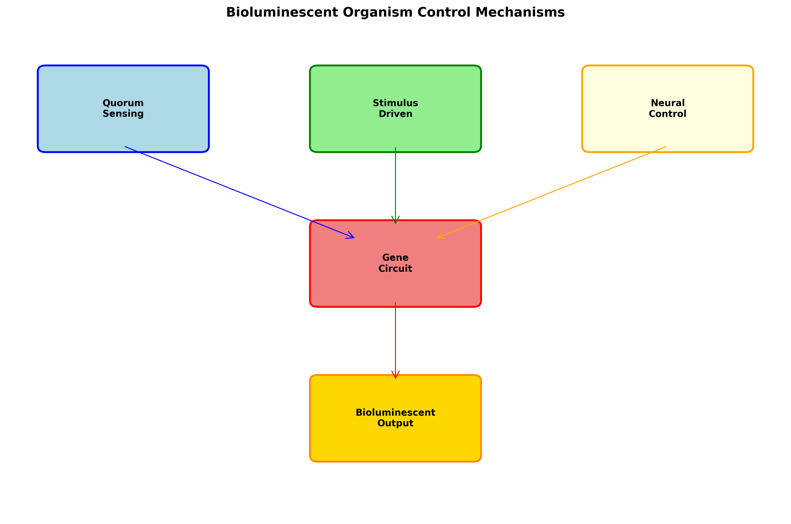
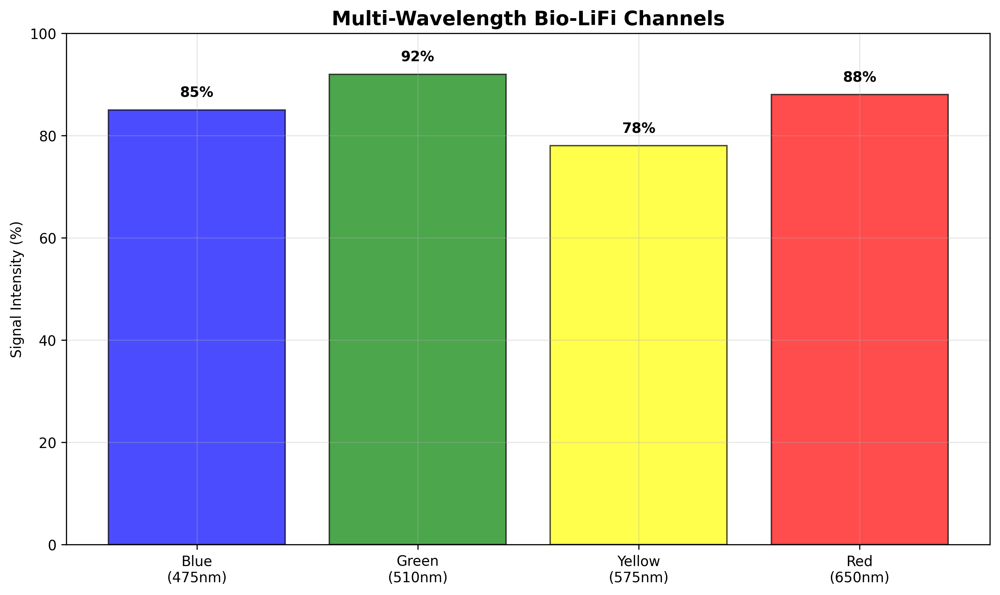
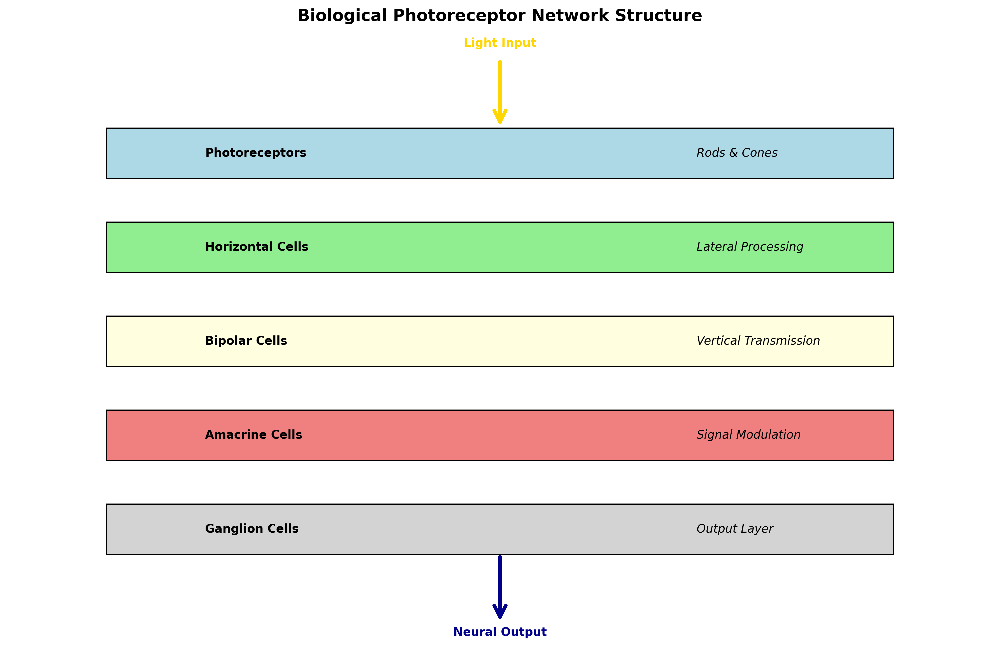
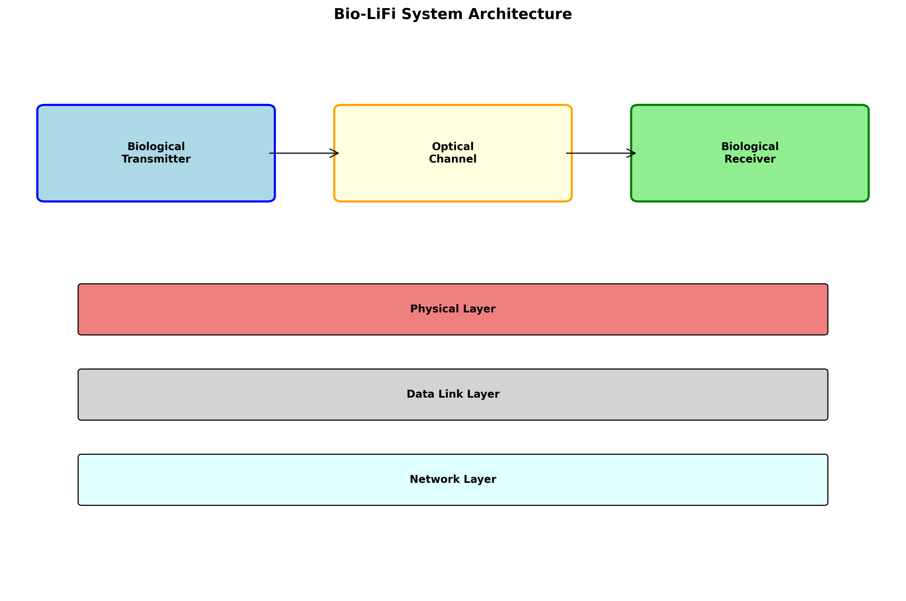
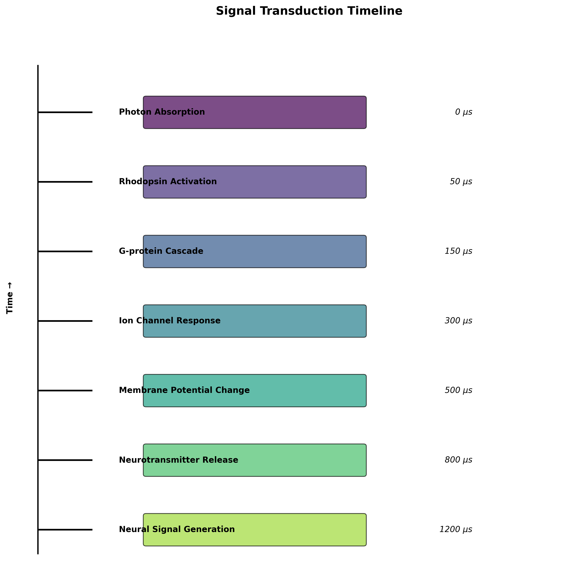
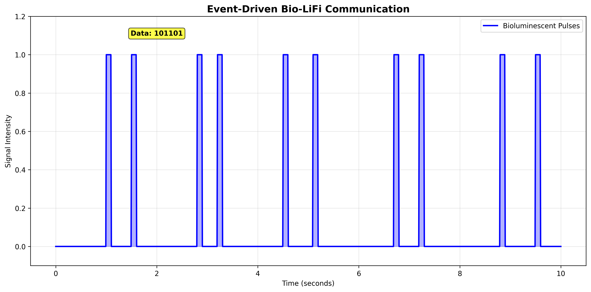
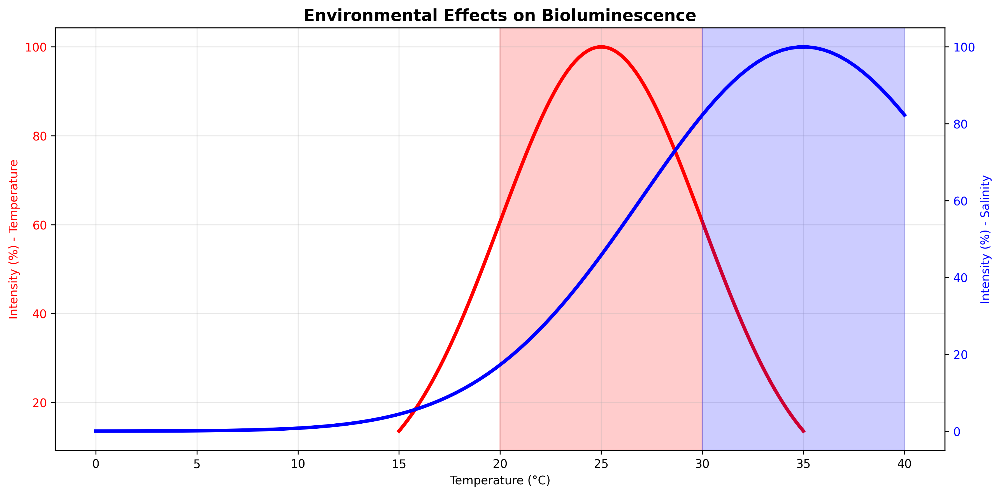
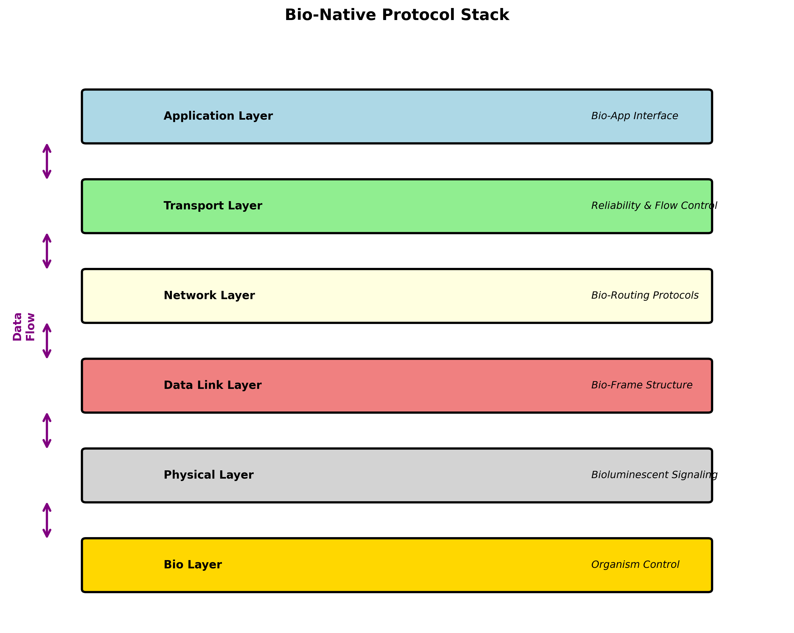
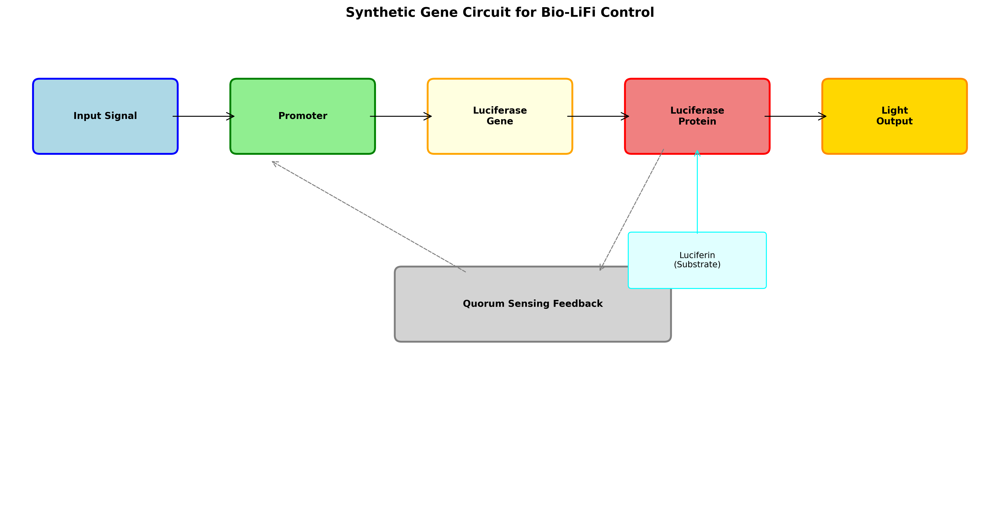

# **Bio-LiFi Communication Systems: A Comprehensive Expert Analysis**
# Visual Diagrams for Bio-LiFi Communication Systems

The following diagrams illustrate key concepts from this report. All images are located in the `bio_lifi_diagrams/` folder.

1. 
2. 
3. 
4. 
5. 
6. 
7. 
8. 
9. 

## **Executive Summary**

This report presents a comprehensive analysis of photoreceptor-based biological light communication systems, integrated with software-defined radio (SDR)/modem architectures for bio-digital data transmission. The central thesis of this report is that a communication paradigm, termed "Bio-LiFi," is technically feasible but requires a fundamental shift in design philosophy. Instead of a general-purpose, high-speed communication technology, Bio-LiFi is best conceived as a specialized enabling technology for the emerging field of bio-hybrid systems.  
The viability of this system hinges on the ability of synthetic biology to engineer controllable bioluminescent organisms, effectively transforming them from passive signaling systems into active data transmitters. The inherent limitations of natural systems, such as low modulation speed and high environmental sensitivity, must be overcome through genetic modification and circuit design. On the digital side, conventional communication architectures are ill-suited for the slow, asynchronous, and noisy nature of biological signals. Instead, the analysis indicates that neuromorphic computing represents the optimal digital architecture due to its event-driven, massively parallel processing, which aligns symbiotically with the pulsed nature of engineered bioluminescent signals.  
The implementation roadmap for a functional Bio-LiFi system is envisioned as a phased research and development process. It begins with computational modeling to simulate and optimize biological network dynamics and progresses to the co-design of biological and digital components in a controlled laboratory setting. The final stage involves field-testing the system in low-data-rate, high-value applications like environmental monitoring. This phased approach is critical for managing the system's complexity and addressing the inherent unpredictability of living components.  
Strategic recommendations for advancing this field include a concerted R\&D focus on engineering novel bioluminescent circuits, developing neuromorphic signal processing architectures, and establishing a bio-native layered protocol stack. Parallel to these technical efforts, it is crucial to engage in interdisciplinary co-design with regulatory and biosecurity stakeholders from the outset. This proactive approach is necessary to address the dual-use nature of the technology and build a robust, responsible governance framework for the broader field of bio-digital convergence.  
---

## **Part I: The Biological Communication Subsystem**

### **Chapter 1: Bioluminescent Organisms as Biological Transmitters**

#### **1.1. Natural Bioluminescent Systems: Diversity and Control Mechanisms**

The natural world offers a diverse array of bioluminescent phenomena, each with its own unique mechanism for light production. Understanding these mechanisms is the critical first step in determining their potential for a Bio-LiFi system. One of the most well-documented control systems is quorum sensing (QS), which is observed in marine bacteria such as *Vibrio fischeri*.1 This process is a form of cell-to-cell communication where bacteria release diffusible signaling molecules, known as autoinducers, into their environment. Once the population reaches a sufficient density, the concentration of these autoinducers triggers the activation of a set of genes, known as the  
*lux* operon, which in turn leads to the production of light.3 This density-dependent mechanism is inherently slow, operating on the timescale of population growth and autoinducer diffusion, which can take hours.3 This temporal characteristic presents a significant challenge for digital communication, where rapid, on-demand modulation is essential.  
Another natural system is stimulus-driven bioluminescence, as seen in dinoflagellates like *P. lunula* and *L. polyedrum*. These single-celled marine organisms produce a rapid flash of light when subjected to mechanical stress, such as fluid shear or wave action.5 The light production is mediated by a change in intracellular calcium levels that leads to an action potential, which then opens voltage-gated proton channels and lowers the internal pH.5 This drop in pH catalyzes the oxidation of luciferin by luciferase, resulting in a flash of light.5 While this response is more rapid than quorum sensing, the flash itself is characterized by a quick rise time followed by an uncontrolled, longer decay period.5 The inability to precisely control the "off" state of this signal makes it difficult to use for reliable digital encoding.  
Finally, some advanced organisms, particularly deep-sea species and sea pens, exhibit neural control over their bioluminescence. These animals possess specialized light-producing organs called photophores, which are regulated by their nervous systems. This allows for a degree of control over light output, including the ability to adjust intensity or turn the light on and off entirely.7 This level of control is a promising starting point but remains limited in scope and is not directly accessible for arbitrary data encoding.  
A critical limitation of these natural systems for a Bio-LiFi application is their intrinsic low-frequency, high-latency nature. The regulatory mechanisms, whether based on population density, mechanical stress, or neural commands, are not designed for the rapid, binary state changes required for digital communication. This means that natural bioluminescence, in its raw form, is not a communication channel but a signaling system. Furthermore, the efficiency of these biological reactions, and therefore the intensity and reliability of the light output, is highly dependent on environmental variables. For example, in dinoflagellates, bioluminescence intensity is negatively correlated with temperature and salinity, with a 1°C increase causing a roughly 15% decrease in light output.9 This channel state dependency means a Bio-LiFi protocol would have to be highly adaptive, constantly adjusting to environmental fluctuations, which adds a significant layer of complexity to system design.

#### **1.2. Engineering Bioluminescence for Digital Communication**

The inherent limitations of natural bioluminescence necessitate an engineered approach using synthetic biology to create a truly viable data transmitter. This involves designing and integrating synthetic gene circuits into host organisms, a process that can be achieved through techniques like gene cloning, promoter engineering, and codon optimization.11  
A key target for modification is the firefly luciferase (FLuc) system, a widely used reporter enzyme in biotechnology.12 Mutations in the FLuc enzyme have been shown to improve sustained light output, alter the emission spectrum for longer wavelengths, or increase the enzyme's affinity for specific synthetic substrates.13 This is a crucial step toward building a light source with predictable and tunable properties.  
A significant advancement in this area is the development of multi-wavelength communication through Bioluminescence Resonance Energy Transfer (BRET) systems. A dual-acceptor BRET system has been engineered to produce up to 20 distinct bioluminescent colors from a single light source.14 This is not merely a scientific demonstration but a direct path to multi-channel optical communication, a foundational principle of LiFi. By encoding data onto different wavelengths, the system can dramatically increase its data-carrying capacity and enable spatial multiplexing, using multiple light sources to transmit parallel streams of information.16 This represents a powerful way to enhance the capabilities of a biological transmitter, effectively creating a biological equivalent of a digital optical comb generator.  
Most importantly, synthetic gene circuits offer a solution to the latency and temporal control problem. For example, an "optoscillator" circuit, based on a modified repressilator, has been constructed in *E. coli* that can generate complex oscillatory dynamics and spatial ring patterns in response to a pulsed light input.17 This demonstrates that a living system can be programmed to produce a controllable, pulsed output from a digital input. This ability to engineer precise temporal control is the single most important prerequisite for transforming a bioluminescent organism into a functional communication node. By creating a "bio-repeater," a single organism can be a controllable source of digital pulses, enabling data transmission at a speed and precision far beyond that of natural systems.

### **Chapter 2: Biological Photoreceptor Networks as Data Receivers**

#### **2.1. The Retina as a Bio-Digital Receiver**

The retina is a highly specialized, layered neural network that functions as both an optical sensor and an analog signal processor. It is composed of photoreceptor cells (rods and cones), which transduce photons into electrical signals, and a complex network of interneurons (bipolar cells, horizontal cells, and amacrine cells) that process this information before it is transmitted to the brain via retinal ganglion cells (RGCs).19  
The response characteristics of photoreceptors are a key constraint on a Bio-LiFi system. Rods, which are sensitive to dim light, and cones, which are active in bright light, have different response speeds. Cones have a response time roughly four times faster than rods, which can take up to 300 ms to fully signal the absorption of a single photon.22 This slow response time, coupled with the latency of the subsequent neural processing in the RGCs (which have a fixed latency of around 190-250 ms in response to motion reversal) 24, means that the total end-to-end latency of a Bio-LiFi system is a multi-stage problem. The communication delay is not just the time it takes for light to travel, but the cumulative time of the photochemical reaction, signal transduction, and neural processing, which collectively render high-speed communication impossible.25  
A particularly interesting type of photoreceptor is the intrinsically photosensitive retinal ganglion cell (ipRGC). These cells contain the photopigment melanopsin, making them directly sensitive to light, especially in the blue spectrum (\~470 nm), even in the absence of input from rods and cones.26 A key feature of these cells is their sustained, fatigue-resistant firing in response to continuous light stimulation, a property that is well-suited for signaling the presence of a light source rather than rapid fluctuations.27 The intrinsic, melanopsin-mediated light response has a slow onset of over 2.5 seconds.28 This intrinsic slowness further reinforces the notion that a Bio-LiFi system must be designed for low-frequency, event-driven data transmission.  
The retina's function as a pre-processor is a fundamental architectural consideration. It is not a passive camera sensor; it actively processes visual information to extract features like contrast, motion, and edges.19 The output of a Bio-LiFi system, therefore, should not be a raw image but a data stream that is compatible with the retina's native processing capabilities. This suggests a design philosophy where the biological receiver performs much of the initial signal processing, which can then be decoded by a digital modem. This effectively shifts a portion of the computational burden from the digital domain to the biological domain.

#### **2.2. Artificial and Bio-Hybrid Retinal Interfaces**

The development of artificial retinal implants and bio-hybrid interfaces provides a powerful proof-of-concept for a functional optical receiver, while also offering a pathway to overcome the limitations of the native retina. Devices such as the PRIMA implant use arrays of photovoltaic pixels that are surgically placed in the subretinal space.31 These pixels directly convert pulsed near-infrared light from an external video-camera system into electrical currents that stimulate the remaining inner retinal neurons, particularly the bipolar cells.21 This process bypasses the non-functional outer retinal layer, effectively creating a communication bridge.  
The signal processing in these artificial systems is highly sophisticated. External processing units apply algorithms to enhance images, detecting features like edges and contours, before transmitting them to the implant.21 This pre-processing is essential because the limited number of pixels in the implant (e.g., 378 pixels in one design) cannot provide a high-fidelity image.31 The performance of these implants is remarkable, with a reported RGC spike latency in the range of 1-100 milliseconds and a frequency response up to 500 Hz.31 This is a significant improvement over the slow, native retinal response and demonstrates that a functional bio-digital optical interface is not only possible but can also be engineered to perform at speeds compatible with a low-to-moderate data rate.  
Further along the technology curve are true bio-hybrid neural interfaces. These systems, like the one described by Science Corporation, use living neurons that are anchored to a device to form a non-destructive, high-bandwidth connection to the brain.36 These devices integrate microLEDs and optogenetics for stimulation and micro-electrodes for recording, creating a fully bidirectional interface.36 This approach bypasses the need to rely on the native photoreceptors and allows for a direct, high-fidelity connection between the digital system and the biological neural network. The existence of these diverse technologies, from simple prostheses to complex bio-hybrid interfaces, confirms that the concept of a functional optical receiver is not purely theoretical. The design of an effective Bio-LiFi protocol can draw a direct analogy from these systems. Since retinal implants encode information into a sparse spiking pattern based on changes in illumination 31, a pulsed bioluminescent event from a biological transmitter would be the ideal input for such a system.

## **Part II: The Digital and Computational Framework**

### **Chapter 3: Software-Defined Biological Modem Architectures**

#### **3.1. SDR and Its Adaptation for Biological Signals**

The traditional hardware-centric approach to communication systems is ill-suited for the dynamic and unpredictable nature of biological channels. Software-defined radio (SDR) offers a flexible and adaptive alternative. In an SDR, functions typically implemented in hardware—such as filters, modulators, and error correction—are instead defined in software and run on reprogrammable digital components like FPGAs or digital signal processors (DSPs).38 This provides a key advantage: the ability to update communication protocols and adapt to changing conditions with a simple software push, without requiring a complete hardware overhaul.38  
The concept of SDR can be extended beyond conventional radio to create a "Software-Defined Biological Modem" (SDBM). A conceptual architecture for a Universal Underwater Software Defined Modem (UniSDM) provides a perfect blueprint for this approach.40 The UniSDM architecture integrates multiple communication modes (e.g., acoustic, magnetic induction, optical) into a single, flexible device.40 This design philosophy is highly relevant to Bio-LiFi, as the biological channel is not a single, monolithic entity. It is a multimodal environment encompassing light, chemical signaling, and electrical pathways, each with unique properties and latencies. An SDBM would be able to probe the state of the biological channel—for example, assessing the light intensity and response time of a bioluminescent population—and dynamically select the most appropriate communication mode and protocol. The flexibility of this architecture is not a luxury; it is a fundamental requirement for building a robust and reliable interface with the unpredictable biological world.

#### **3.2. Neuromorphic and FPGA-based Architectures**

A conventional CPU-based system, with its rigid, sequential processing architecture, is poorly suited for the asynchronous, event-driven nature of biological signals. A more promising approach is to adopt neuromorphic computing, a brain-inspired paradigm that leverages event-driven, massively parallel architectures for efficient data processing with extremely low latency and energy consumption.42  
The synergy between a bioluminescent "event"—a flash from a cell—and a neuromorphic "event-based" processor is a powerful one. Instead of trying to force a slow, noisy biological signal into a high-frequency digital clock, a neuromorphic processor would treat each flash as a discrete event. This approach respects the asynchronous nature of the biological channel and allows the system to process information with orders of magnitude less power and latency than a conventional CPU.44 The Intel Loihi and IBM TrueNorth chips are examples of such hardware, designed to process data from event-based cameras that mimic the human retina's per-pixel response to light changes.37 This is a crucial architectural decision for the digital side of the modem, as it enables the system to "cognitively process" information in a manner closer to a living organism.  
For a more immediate and customizable implementation, Field Programmable Gate Arrays (FPGAs) can be used. FPGAs are reprogrammable devices that, unlike CPUs, can execute many computations in parallel.49 This parallel nature makes them ideal for implementing the complex mathematical models of neural networks in a hardware-accelerated fashion.49 By using FPGAs, a biologically plausible neural network model can be implemented that is both high-speed and scalable, ensuring real-time operation and a degree of biological realism that is difficult to achieve with conventional sequential software.50 This approach allows researchers to create a functional neuromorphic processor without needing to custom-fabricate an application-specific integrated circuit (ASIC).

### **Chapter 4: Bio-Digital Interface Hardware and Signal Processing**

#### **4.1. Optical Sensor Technology for Bioluminescence**

The detection of bioluminescent signals, which are often extremely dim, requires a careful selection of sensor technology. The optimal choice depends on the characteristics of the bioluminescent source, highlighting the necessity of a co-design approach where the biological and digital components are developed in concert.  
For detecting very weak or continuous bioluminescence signals over long periods, such as from a fungal colony or a slow-reacting bacterial culture, Electron-Multiplying Charge-Coupled Devices (EMCCDs) and deep-cooled CCD cameras are the ideal choice.51 These sensors excel at accumulating photons over long exposure times while maintaining an extremely low dark current, which is essential for maximizing the signal-to-noise ratio (SNR) in photon-starved applications.53 The sensitivity of EMCCDs is further enhanced by their ability to amplify electrons on the sensor itself, allowing for single-photon detection.52  
Conversely, for systems that rely on a rapid, pulsed bioluminescent source, such as an engineered optogenetic circuit, speed is the priority over long exposure times. Here, scientific CMOS (sCMOS) cameras offer a compelling alternative. sCMOS sensors provide rapid frame rates, a large field of view, and high resolution.51 While their dark current is higher than that of EMCCDs, a fast sCMOS camera can capture each discrete light pulse with high fidelity. For applications requiring extremely high speed and single-photon sensitivity, Avalanche Photodiodes (APDs) and Photomultiplier Tubes (PMTs) are also excellent options.57 APDs provide internal gain and have a high SNR and fast response time 57, while PMTs offer even greater sensitivity and are also used for single-photon detection.58  
The selection of a detector is a classic engineering trade-off. An EMCCD is a high-sensitivity, low-speed solution for dim signals, while a fast sCMOS or APD is a high-speed, moderate-sensitivity solution for pulsed signals. The co-design of a bioluminescent transmitter and its corresponding optical receiver is therefore a non-negotiable step in the development of a functional Bio-LiFi system.

#### **4.2. Advanced Signal Processing for Biological Signals**

The role of digital signal processing (DSP) in a Bio-LiFi system extends far beyond simple demodulation. The raw signal from a biological source is likely to be noisy, irregular, and susceptible to long-term drift. Therefore, advanced signal processing techniques are required to transform these signals into reliable information.  
Standard DSP techniques, such as Fourier and wavelet transforms, can be used to filter out noise and extract key features from the time-varying light signals.60 For example, adaptive filtering can be used to mitigate noise that changes with environmental conditions.60 However, a more bio-inspired approach offers additional advantages. Neuromorphic systems are being developed that can emulate the function of an avian optic nerve, performing perception, processing, and memory functions in a single device.61 These devices can handle multilevel optical storage using very weak light intensities and can pre-process and eliminate redundant information before it is transmitted to a higher-level processing unit.61 This is a critical departure from conventional signal processing and is particularly well-suited for a Bio-LiFi application where the biological signal is both weak and information-sparse.  
The challenge of long-term signal stability is another area where advanced signal processing is crucial. Biological sensors and systems can exhibit signal drift over time due to factors like molecular dissociation or the aging of the organism.62 To maintain reliability, the system must be able to recognize and compensate for this drift. Adaptive filtering techniques and machine learning models can be used to learn the characteristic noise and drift patterns of a specific biological population and adjust the decoding algorithm accordingly. This ensures that the system remains calibrated and reliable over extended periods.  
---

#### **Table 1: Bio-Digital Receiver Hardware Comparison**

| Technology | Key Advantages | Key Disadvantages | Ideal Use Case |
| :---- | :---- | :---- | :---- |
| **EMCCD** | Highest sensitivity, single-photon detection, ultra-low dark current.52 | Slower frame rates, lower resolution, smaller field of view.56 | Long-exposure imaging of dim, continuous bioluminescence from populations.51 |
| **sCMOS** | High speed (100+ fps), high resolution, wide field of view, lower cost.51 | Higher dark current than EMCCD, limited single-photon detection capability.54 | High-speed imaging of fast, pulsed bioluminescent events.51 |
| **APD** | High sensitivity, high internal gain, fast time response, low dark current.57 | Small active area, inverse relationship between active area and bandwidth.64 | Single-photon counting and high-speed detection of discrete light pulses.57 |
| **PMT** | Extremely high gain and sensitivity, single-photon counting, large active areas.58 | Bulkier and more fragile than solid-state detectors, requires high voltage.66 | Photon-level detection for applications with very weak light sources and low signal levels.58 |

---

## **Part III: System Integration, Performance, and Protocols**

### **Chapter 5: Bio-LiFi Communication Protocols and Performance Metrics**

#### **5.1. Modulation Schemes and Protocols for Biological Systems**

The intrinsic characteristics of biological systems—such as slow response times and vulnerability to environmental fluctuations—dictate that conventional high-speed LiFi protocols are fundamentally unsuitable for a Bio-LiFi system. A traditional LiFi system might use modulation schemes like On-Off Keying (OOK), Pulse Width Modulation (PWM), or Manchester encoding at data rates of gigabits per second (Gbps).69 However, the biological channel, with its millisecond-to-second response latency 24 and low-frequency signaling (\<40 Hz) 73, cannot support these speeds.  
Instead, a Bio-LiFi system must be built on a new class of protocols designed for low-frequency, event-driven communication. The goal is not to transmit a high-bandwidth video stream, but rather sparse, high-value data, such as a state change, a specific measurement, or a simple "ready" signal. The most viable modulation schemes would be very low-frequency adaptations of OOK or PWM, perhaps operating in the Hz-to-kHz range at most. The design of these protocols can draw inspiration from low-power Internet of Things (IoT) technologies like LoRaWAN, which are optimized for low-data-rate, long-range communication from battery-powered sensors.74 These protocols prioritize the reliable delivery of essential information using data compression and efficient encoding, which are precisely the requirements of a Bio-LiFi system.75 This re-framing of the problem from a high-speed to a low-speed paradigm is central to the viability of Bio-LiFi.

#### **5.2. Error Correction and Signal Reliability**

The biological communication channel is inherently unreliable and susceptible to various forms of noise. Unlike a fiber optic cable, which is a static and predictable medium, a population of living organisms is a dynamic, memoryless, and often bursty channel. For example, a sudden temperature change or nutrient depletion could cause a group of bioluminescent organisms to fail simultaneously, creating a "burst" of signal loss or noise.9  
To address this, Forward Error Correction (FEC) is a critical component of the Bio-LiFi protocol stack.76 FEC adds a controlled amount of redundant data to the transmitted message, enabling the receiver to detect and correct a limited number of errors without requiring a retransmission. A particularly effective technique for this channel is interleaving, which shuffles the order of data bits across multiple codewords.76 If a burst of errors occurs—for instance, if a section of the bioluminescent colony fails—interleaving ensures that these errors are distributed among many different codewords, making them appear as isolated, random errors that are much easier for a standard FEC decoder to correct.79  
Achieving reliability in the biological component itself requires a different approach. As a single engineered cell is highly susceptible to noise and stochastic fluctuations in gene expression, the system's reliability should be based on the collective behavior of a large population of cells rather than on the precision of any single cell.80 This redundancy and intercellular communication serve as a form of biological error correction, ensuring that the overall signal remains stable even if individual agents fail.

#### **5.3. Characterizing Performance: Data Rates, Latency, and Environmental Impact**

To assess the potential performance of a Bio-LiFi system, it is essential to establish realistic metrics, acknowledging the immense performance gap between biological and conventional digital systems.  
The theoretical maximum data rate for any communication channel is defined by the Shannon-Hartley theorem, which establishes an upper bound based on the channel's bandwidth and signal-to-noise ratio (SNR).81 For a Bio-LiFi system, both of these parameters are highly constrained. The bandwidth is limited by the slow response kinetics of bioluminescence (\~100 ms) 72 and the low-frequency processing of retinal neurons (with most information concentrated below 30-40 Hz).73 The SNR is not a fixed value but is a function of a host of environmental factors, such as temperature, pH, and nutrient availability, which can cause significant and unpredictable changes in the bioluminescent signal intensity.9  
Therefore, the channel capacity of a Bio-LiFi link is not a fixed number but a dynamic, variable quantity. This underscores the need for an adaptive, software-defined protocol that can adjust its modulation scheme and error correction parameters in real-time to maintain a reliable connection as the biological channel state fluctuates.84  
A realistic assessment of data rate would project not gigabits per second, but perhaps a few hundred bits per second (bps) at most, with a significant portion of the bandwidth dedicated to error correction and synchronization. The latency of the system would be dominated by the biological response times, likely in the hundreds of milliseconds, making it suitable for asynchronous, non-real-time data transfer rather than interactive applications.  
---

#### **Table 2: Performance Characteristics of Bio-LiFi Systems (Theoretical/Modeled)**

| Metric | Natural Bioluminescent Systems | Engineered Bioluminescent Systems | Artificial Retinal Prostheses |  |
| :---- | :---- | :---- | :---- | :---- |
| **Max Data Rate** | Extremely low; sub-bps to single bps. Uncontrolled signaling, not communication. | Theoretical low-rate digital communication possible. Likely in the range of tens to hundreds of bps.72 | \~40-70 bps from RGCs to the brain, with potential for higher rates in specific pathways.73 |  |
| **Biological Latency** | **Vibrio fischeri:** \~100 ms response time.72 |  Dinoflagellates: Rapid flash but slow decay.5 | Can be reduced and controlled via optogenetic gene circuits, but still limited by reaction kinetics.17 | 1-100 ms for stimulated RGC spikes.35 |
| **Sensitivity to Temp/Salinity** | Bioluminescence intensity negatively correlated with temperature and salinity, with a 1°C increase causing a \~15% drop in light intensity.9 | Can be mitigated through the design of robust gene circuits, but remains a significant challenge. | Not directly applicable as the light source is artificial.32 |  |

---

## **Part IV: Applications, Viability, and Governance**

### **Chapter 6: Computational Modeling and Optimization of Bio-Networks**

#### **6.1. Agent-Based Modeling of Bioluminescent Organisms**

The development of a Bio-LiFi system requires a design methodology that can contend with the collective behavior of living organisms. The physical layer of such a system is not a static component but a dynamic population of living agents. Agent-Based Models (ABMs) are a crucial computational tool for simulating this complexity from a "bottom-up" perspective.85 ABMs can model individual cells or organisms, each with its own set of rules and behaviors, and then observe how their interactions lead to emergent, population-level phenomena.86  
This approach is highly valuable for simulating bioluminescent networks. For instance, a multi-agent model has been used to simulate the quorum-sensing behavior of bacteria, showing how individual cells "tweet" via molecular signals to produce coordinated, self-sustainable network behaviors.89 This allows researchers to study how a population might synchronize its flashes, how a signal propagates through a colony, and how environmental changes affect the collective behavior in a virtual environment before ever building a physical prototype. ABM is therefore a critical first step in the implementation roadmap, providing a virtual testbed for optimizing the biological component of the system.

#### **6.2. Evolutionary Algorithms for Protocol Optimization**

The co-evolutionary nature of a Bio-LiFi system—where a digital protocol must be optimized to work with a living network—necessitates a novel design methodology. The optimal protocol for a given biological channel may not be one that an engineer would intuitively design. Evolutionary algorithms (EAs), a class of bio-inspired metaheuristic algorithms, are an ideal tool for this problem.90 EAs, including genetic algorithms (GAs), mimic natural selection by iteratively refining a population of candidate solutions based on a "fitness function".90  
A particularly relevant variant for this domain is the co-evolutionary algorithm, where the fitness of a solution is evaluated based on its interactions with other solutions in the population.90 This is perfect for Bio-LiFi, where the "solutions" are both the digital protocols and the configurations of the biological network. For example, a multi-objective GA could be used to optimize a protocol to balance competing objectives, such as minimizing data latency while maximizing error correction or energy efficiency.93 This allows the system to "breed" a protocol that is uniquely adapted to the specific, and often noisy, characteristics of the biological channel. This design methodology, which is a direct consequence of the biological nature of the system, moves beyond conventional engineering and into the realm of computational biology.

### **Chapter 7: Practical Applications and Commercial Viability**

#### **7.1. Bio-Hybrid Systems and Computing Interfaces**

The core commercial viability of Bio-LiFi does not lie in competing with conventional high-speed communication technologies. Its true niche is as an enabling technology for the broader field of bio-hybrid systems. Bio-hybrid systems, which integrate living tissues or cells with artificial components, perform tasks that neither component could achieve alone.96 Bio-LiFi provides the communication layer for these emergent systems, enabling the living component to transmit data to the digital one.  
A bioluminescent bacterial sensor network in a bioreactor, for instance, could be engineered to "flash" a specific light pattern when a target metabolite or pollutant is detected.98 This low-data-rate signal could be wirelessly transmitted to a digital controller, which then takes an action. Similarly, a bio-hybrid robot powered by living muscle cells could use pulsed bioluminescence to signal its health status or the completion of a task to a remote operator.97 The Bio-LiFi interface is the critical link in these systems, allowing the nuanced, low-power sensing capabilities of biology to be integrated with the computational power and control of technology. This perspective places Bio-LiFi within the multi-trillion dollar biotechnology market 99, focusing on high-value, niche applications where the living component is already present.

#### **7.2. Medical and Environmental Applications**

Bio-LiFi offers compelling use cases in medical and environmental monitoring, where its unique properties, such as a lack of electromagnetic interference and inherent biocompatibility, provide a significant advantage.  
In medical settings, LiFi has been proposed for use in hospitals where radio-frequency interference with sensitive medical equipment is a concern.100 A Bio-LiFi system could take this a step further by using bioluminescent reporters to signal physiological states in real-time. For example, optogenetics, a technology for controlling neural circuits with light, is already a key component in bio-hybrid systems for medical research.36 Bio-LiFi could act as the communication channel to relay information from a diagnostic sensor to an external control unit, or to a "Bio-Digital Twin"—a virtual model of a biological system used for research and treatment—to aid in the design of new therapies.102  
In environmental monitoring, bioluminescence-based assays are already in use for detecting pollution and ensuring hygiene.98 Bio-LiFi extends this by enabling a distributed network of bioluminescent organisms to act as a wireless sensor network. Low-cost optical sensors can already be used for real-time monitoring of microalgae concentration 103, and a Bio-LiFi system could integrate this with a network of genetically engineered bacteria that change their light output in response to specific toxins. This provides a data-rich, spatially distributed monitoring system that is both low-power and bio-compatible, offering a valuable alternative to conventional environmental sensors.

### **Chapter 8: Challenges, Standards, and the Ethical Framework**

#### **8.1. The Need for a Layered Protocol Stack and Standardization**

The complexity of a Bio-LiFi system, with its intertwined biological and digital components, necessitates a modular and scalable design approach. The well-established layered architectures of computer networking, such as the OSI model, provide a conceptual blueprint for this.104 A "bio-native" protocol stack would define the specific functions and responsibilities of each layer, from the biological physical medium to the digital application interface.  
The Bio-Physical layer would encompass the core biological functions of light emission and detection.107 This includes the engineering of bioluminescent pathways for a controllable light source and the selection of an appropriate optical sensor for signal acquisition. The Bio-Link layer would then manage the fundamental digital-to-biological conversion, including modulation schemes adapted for low-frequency signals and error correction for the bursty nature of the biological channel. Higher layers, such as the Bio-Network and Bio-Application layers, would manage the collective behavior of a multi-agent population of organisms and provide a bridge to conventional digital networks for data analysis and control.  
This structured approach is essential for managing the system's complexity, ensuring interoperability between different components, and enabling a collaborative "co-design" process with researchers from diverse fields.108 The development of these standards is a crucial step for any emerging technology to gain market acceptance and avoid the fragmentation that has plagued other communication protocols.104

#### **8.2. Ethical and Biosecurity Considerations**

Bio-digital convergence, and by extension Bio-LiFi, is a classic "dual-use" technology with significant ethical and biosecurity implications. The very capability that makes Bio-LiFi useful—the remote digital control of biological organisms—is also its greatest risk. The ability to program and wirelessly communicate with engineered biological agents could, in the wrong hands, be used for malicious purposes, such as creating novel pathogens or toxins that are digitally controlled and deployable.110  
This raises a host of ethical concerns, including data privacy, the potential for algorithmic bias in bio-digital systems, and the moral status of "semiliving beings" that are part biological and part machine.111 The current regulatory landscape for synthetic biology and bio-hybrid systems is inconsistent and has significant gaps, with a pressing need for international coordination on standards and governance frameworks.113  
A mature Bio-LiFi development roadmap must therefore include a proactive "biosecurity-by-design" approach that addresses these risks from the project's inception. This requires a commitment to transparency, a robust governance framework, and an interdisciplinary dialogue that includes ethicists, legal experts, and policymakers alongside scientists and engineers. Failure to address these concerns from the outset would not only be irresponsible but could also lead to a public and regulatory backlash that stifles the technology's development entirely.  
---

#### **Table 3: Proposed Bio-Digital Communication Protocol Stack**

| Layer | Bio-Physical Analogy | Responsibility & Function | Corresponding Bio-Digital Components |
| :---- | :---- | :---- | :---- |
| **Bio-Physical Layer** | Bioluminescent organism/photoreceptor | Light emission & detection, wavelength selection, physical synchronization. | Engineered luciferase, optogenetic circuits, EMCCD/sCMOS cameras, APD arrays.17 |
| **Bio-Link Layer** | Engineered gene circuit & signal transduction | Modulation/demodulation of light pulses, low-level error detection & correction, channel access control. | On-chip DSP for signal processing, adaptive modulation algorithms, burst error correction with interleaving.60 |
| **Bio-Network Layer** | Population dynamics & quorum sensing | Synchronization of multiple bioluminescent agents, routing of signals through a multi-agent population, redundant channel management. | Agent-based modeling simulations, evolutionary algorithms for network topology, multi-channel BRET systems.14 |
| **Bio-Transport Layer** | Molecular communication/chemical gradients | End-to-end reliability, flow control, data packetization from biological signals. | Software-defined modem architecture, bio-native protocols for data integrity.104 |
| **Bio-Application Layer** | System-wide response & task completion | Interface with digital systems for data interpretation, high-level command & control, user-facing applications. | Neuromorphic computing for pattern recognition, cloud/edge computing for data analysis, bio-hybrid system interfaces.42 |

---

## **Conclusion**

The analysis concludes that Bio-LiFi is a technically plausible but highly specialized communication paradigm. Its viability is contingent on a fundamental re-evaluation of its purpose and architecture, moving away from a high-speed communication model and toward a low-data-rate, event-driven signaling system for bio-hybrid applications. The key to unlocking its potential lies in the symbiotic co-design of biological and digital components.

### **Feasibility Assessment and Implementation Roadmap**

A phased roadmap is proposed for the development of Bio-LiFi:

1. **Phase 1: Computational Modeling.** The initial stage should focus exclusively on in-silico simulation. Using agent-based models, researchers can simulate the emergent behaviors of bioluminescent populations under various environmental conditions and test the efficacy of different control protocols. Concurrently, evolutionary algorithms can be employed to co-evolve optimal communication protocols with a simulated biological network, providing a data-driven foundation for physical design.  
2. **Phase 2: Lab-Scale Prototype.** This phase involves building a small-scale, controlled system. It would integrate genetically engineered bioluminescent organisms, designed for rapid, pulsed outputs, with high-sensitivity optical receivers and a neuromorphic-based software-defined modem. This prototype would be used to validate the models from Phase 1 and refine the hardware-software-biology interface.  
3. **Phase 3: Field-Testing and Standardization.** The final phase involves deploying the system in a real-world, low-stakes application, such as environmental monitoring in a closed bioreactor. This will test the system's robustness against real-world fluctuations. Simultaneously, a concerted effort must be made to work with regulatory bodies and biosecurity experts to establish a standards roadmap, address ethical concerns, and develop a transparent governance framework for the technology.

### **Final Recommendations**

Based on this analysis, the following recommendations are made for the strategic advancement of Bio-LiFi:

* **Embrace Synthetic Biology:** The development of a controllable, pulsed bioluminescent transmitter is not possible with natural systems. R\&D efforts should be concentrated on synthetic biology to create gene circuits that can be reliably modulated with digital inputs.  
* **Adopt Neuromorphic Architecture:** The digital modem architecture must be designed to work with, not against, the asynchronous nature of biological signals. Neuromorphic computing, with its event-driven processing, is the optimal architectural choice for this.  
* **Develop a Bio-Native Protocol Stack:** Bio-LiFi cannot simply adapt existing LiFi protocols. A new, layered protocol stack must be designed from the ground up, with each layer addressing the unique challenges of the biological channel.  
* **Prioritize Low-Data-Rate Applications:** The commercial viability of Bio-LiFi is in niche, high-value applications for bio-hybrid systems, not in general-purpose communication. Initial applications should focus on low-data-rate, high-reliability signaling for fields like environmental monitoring and medical diagnostics.  
* **Mandate Biosecurity-by-Design:** As a dual-use technology, Bio-LiFi requires proactive engagement with biosecurity and ethical considerations from the earliest stages of research. A transparent, collaborative governance framework must be developed in parallel with the technology itself.

The future of Bio-LiFi lies not in a technological arms race for speed but in a thoughtful, interdisciplinary design process that respects and leverages the unique properties of the living world. The ultimate success will be defined not by bits per second, but by the creation of a reliable and responsible bridge between the biological and digital domains.

#### **Works cited**

1. Quorum Sensing: Unravelling the Intricacies of Microbial Communication for Biofilm Formation, Biogeochemical Cycling, and Biotechnological Applications \- MDPI, accessed August 13, 2025, [https://www.mdpi.com/2077-1312/11/8/1586](https://www.mdpi.com/2077-1312/11/8/1586)  
2. Control of bioluminescence in Vibrio fischeri by the LuxO signal response regulator, accessed August 13, 2025, [https://pubmed.ncbi.nlm.nih.gov/10844649/](https://pubmed.ncbi.nlm.nih.gov/10844649/)  
3. Heterogeneous Response to a Quorum-Sensing Signal in the Luminescence of Individual Vibrio fischeri | PLOS One \- Research journals, accessed August 13, 2025, [https://journals.plos.org/plosone/article?id=10.1371/journal.pone.0015473](https://journals.plos.org/plosone/article?id=10.1371/journal.pone.0015473)  
4. Shedding light on bioluminescence regulation in Vibrio fischeri \- PMC, accessed August 13, 2025, [https://pmc.ncbi.nlm.nih.gov/articles/PMC3359415/](https://pmc.ncbi.nlm.nih.gov/articles/PMC3359415/)  
5. Stress-Induced Dinoflagellate Bioluminescence at the Single Cell Level | Phys. Rev. Lett., accessed August 13, 2025, [https://link.aps.org/doi/10.1103/PhysRevLett.125.028102](https://link.aps.org/doi/10.1103/PhysRevLett.125.028102)  
6. Cellular regulation of dinoflagellate bioluminescence : characterizing mechanosensitive ion channels in the signaling pathway \- eScholarship.org, accessed August 13, 2025, [https://escholarship.org/uc/item/1z04x8qh](https://escholarship.org/uc/item/1z04x8qh)  
7. Bioluminescence | Causes, Examples, & Facts \- Britannica, accessed August 13, 2025, [https://www.britannica.com/science/bioluminescence](https://www.britannica.com/science/bioluminescence)  
8. Bioluminescence \- Definition, Examples, Functions \- Science Notes, accessed August 13, 2025, [https://sciencenotes.org/bioluminescence-definition-examples-functions/](https://sciencenotes.org/bioluminescence-definition-examples-functions/)  
9. (PDF) Effects of typical marine environmental factors on the bioluminescence intensity of individual Noctiluca scintillans \- ResearchGate, accessed August 13, 2025, [https://www.researchgate.net/publication/369590642\_Effects\_of\_typical\_marine\_environmental\_factors\_on\_the\_bioluminescence\_intensity\_of\_individual\_Noctiluca\_scintillans](https://www.researchgate.net/publication/369590642_Effects_of_typical_marine_environmental_factors_on_the_bioluminescence_intensity_of_individual_Noctiluca_scintillans)  
10. Estimation of bioluminescence intensity of the dinoflagellates Noctiluca scintillans, Polykrikos kofoidii, and Alexandrium mediterraneum populations in Korean waters using cell abundance and water temperature \- :: Algae, accessed August 13, 2025, [https://e-algae.org/journal/view.php?number=3011](https://e-algae.org/journal/view.php?number=3011)  
11. www.numberanalytics.com, accessed August 13, 2025, [https://www.numberanalytics.com/blog/synthetic-biology-bioluminescence-applications\#:\~:text=How%20is%20bioluminescence%20engineered%20into,bioluminescent%20pathways%20in%20host%20organisms.](https://www.numberanalytics.com/blog/synthetic-biology-bioluminescence-applications#:~:text=How%20is%20bioluminescence%20engineered%20into,bioluminescent%20pathways%20in%20host%20organisms.)  
12. Firefly Luciferase \- Creative Biogene, accessed August 13, 2025, [https://www.creative-biogene.com/support/Firefly-Luciferase.html](https://www.creative-biogene.com/support/Firefly-Luciferase.html)  
13. Identification of mutant firefly luciferases that efficiently utilize aminoluciferins \- PMC, accessed August 13, 2025, [https://pmc.ncbi.nlm.nih.gov/articles/PMC3273327/](https://pmc.ncbi.nlm.nih.gov/articles/PMC3273327/)  
14. Creating coveted bioluminescence colors for simultaneous multi-color bioimaging \- PMC, accessed August 13, 2025, [https://pmc.ncbi.nlm.nih.gov/articles/PMC11753369/](https://pmc.ncbi.nlm.nih.gov/articles/PMC11753369/)  
15. (PDF) Creating coveted bioluminescence colors for simultaneous multi-color bioimaging, accessed August 13, 2025, [https://www.researchgate.net/publication/388280631\_Creating\_coveted\_bioluminescence\_colors\_for\_simultaneous\_multi-color\_bioimaging](https://www.researchgate.net/publication/388280631_Creating_coveted_bioluminescence_colors_for_simultaneous_multi-color_bioimaging)  
16. Multiplexed bioluminescence imaging with a substrate unmixing platform \- PMC, accessed August 13, 2025, [https://pmc.ncbi.nlm.nih.gov/articles/PMC9675729/](https://pmc.ncbi.nlm.nih.gov/articles/PMC9675729/)  
17. From resonance to chaos by modulating spatiotemporal patterns through a synthetic optogenetic oscillator \- PMC, accessed August 13, 2025, [https://pmc.ncbi.nlm.nih.gov/articles/PMC11343849/](https://pmc.ncbi.nlm.nih.gov/articles/PMC11343849/)  
18. From resonance to chaos: modulating spatiotemporal patterns through a synthetic optogenetic oscillator | bioRxiv, accessed August 13, 2025, [https://www.biorxiv.org/content/10.1101/2024.03.28.586779v1.full-text](https://www.biorxiv.org/content/10.1101/2024.03.28.586779v1.full-text)  
19. How do horizontal cells 'talk' to cone photoreceptors? Different levels of complexity at the cone–horizontal cell synapse \- PubMed Central, accessed August 13, 2025, [https://pmc.ncbi.nlm.nih.gov/articles/PMC5556172/](https://pmc.ncbi.nlm.nih.gov/articles/PMC5556172/)  
20. Visual Processing: Eye and Retina (Section 2, Chapter 14\) Neuroscience Online, accessed August 13, 2025, [https://nba.uth.tmc.edu/neuroscience/m/s2/chapter14.html](https://nba.uth.tmc.edu/neuroscience/m/s2/chapter14.html)  
21. Restoration of Sight with Electronic Retinal Prostheses \- Stanford University, accessed August 13, 2025, [https://web.stanford.edu/\~palanker/publications/Prosthesis\_annurev\_vision\_2025.pdf](https://web.stanford.edu/~palanker/publications/Prosthesis_annurev_vision_2025.pdf)  
22. How Photoreceptor Cells Respond to Light, accessed August 13, 2025, [https://www.reed.edu/math/wieting/mathematics547/Baylor.pdf](https://www.reed.edu/math/wieting/mathematics547/Baylor.pdf)  
23. Speed of phototransduction in the microvillus regulates the accuracy and bandwidth of the rhabdomeric photoreceptor | PLOS Computational Biology \- Research journals, accessed August 13, 2025, [https://journals.plos.org/ploscompbiol/article?id=10.1371/journal.pcbi.1008427](https://journals.plos.org/ploscompbiol/article?id=10.1371/journal.pcbi.1008427)  
24. Synchronized Firing among Retinal Ganglion Cells Signals Motion Reversal \- PMC, accessed August 13, 2025, [https://pmc.ncbi.nlm.nih.gov/articles/PMC3163230/](https://pmc.ncbi.nlm.nih.gov/articles/PMC3163230/)  
25. Photoreceptor encoding of supersaturating light stimuli in salamander retina \- PMC, accessed August 13, 2025, [https://pmc.ncbi.nlm.nih.gov/articles/PMC1464250/](https://pmc.ncbi.nlm.nih.gov/articles/PMC1464250/)  
26. Retinal ganglion cell \- Wikipedia, accessed August 13, 2025, [https://en.wikipedia.org/wiki/Retinal\_ganglion\_cell](https://en.wikipedia.org/wiki/Retinal_ganglion_cell)  
27. Melanopsin Retinal Ganglion Cells and Pupil: Clinical Implications for Neuro-Ophthalmology \- Frontiers, accessed August 13, 2025, [https://www.frontiersin.org/journals/neurology/articles/10.3389/fneur.2018.01047/full](https://www.frontiersin.org/journals/neurology/articles/10.3389/fneur.2018.01047/full)  
28. Intrinsic and Extrinsic Light Responses in Melanopsin-Expressing Ganglion Cells During Mouse Development \- PubMed Central, accessed August 13, 2025, [https://pmc.ncbi.nlm.nih.gov/articles/PMC2493479/](https://pmc.ncbi.nlm.nih.gov/articles/PMC2493479/)  
29. (PDF) Artificial intelligence techniques for retinal prostheses: a comprehensive review and future direction \- ResearchGate, accessed August 13, 2025, [https://www.researchgate.net/publication/367089735\_Artificial\_intelligence\_techniques\_for\_retinal\_prostheses\_a\_comprehensive\_review\_and\_future\_direction](https://www.researchgate.net/publication/367089735_Artificial_intelligence_techniques_for_retinal_prostheses_a_comprehensive_review_and_future_direction)  
30. Retinal prosthesis: artificial neural networks in image encoding \- Tech4Future, accessed August 13, 2025, [https://tech4future.info/en/retinal-prosthesis-artificial-neural-networks-image-encoding/](https://tech4future.info/en/retinal-prosthesis-artificial-neural-networks-image-encoding/)  
31. Retina Prosthesis \- EyeWiki, accessed August 13, 2025, [https://eyewiki.org/Retina\_Prosthesis](https://eyewiki.org/Retina_Prosthesis)  
32. Overview of Retinal Prosthesis and Future Directions | Retinal ..., accessed August 13, 2025, [https://www.retinalphysician.com/issues/2024/may/overview-of-retinal-prosthesis-and-future-directions/](https://www.retinalphysician.com/issues/2024/may/overview-of-retinal-prosthesis-and-future-directions/)  
33. Pixel size limit of the PRIMA implants: from humans to rodents and back \- PubMed Central, accessed August 13, 2025, [https://pmc.ncbi.nlm.nih.gov/articles/PMC9527086/](https://pmc.ncbi.nlm.nih.gov/articles/PMC9527086/)  
34. Implants | PRIMA \- bionic-vision.org, accessed August 13, 2025, [https://www.bionic-vision.org/implants/prima](https://www.bionic-vision.org/implants/prima)  
35. Photovoltaic retinal prosthesis \- SPIE Digital Library, accessed August 13, 2025, [https://www.spiedigitallibrary.org/conference-proceedings-of-spie/7885/1/Photovoltaic-retinal-prosthesis/10.1117/12.876560.full](https://www.spiedigitallibrary.org/conference-proceedings-of-spie/7885/1/Photovoltaic-retinal-prosthesis/10.1117/12.876560.full)  
36. Biohybrid | Science Corporation, accessed August 13, 2025, [https://science.xyz/technologies/biohybrid/](https://science.xyz/technologies/biohybrid/)  
37. Hardware, Algorithms, and Applications of the Neuromorphic Vision Sensor: a Review, accessed August 13, 2025, [https://arxiv.org/html/2504.08588v1](https://arxiv.org/html/2504.08588v1)  
38. What is Software Defined Radio (SDR)? | VIAVI Solutions Inc., accessed August 13, 2025, [https://www.viavisolutions.com/en-us/what-software-defined-radio-sdr](https://www.viavisolutions.com/en-us/what-software-defined-radio-sdr)  
39. What is Software Defined Radio \- Wireless Innovation Forum, accessed August 13, 2025, [https://www.wirelessinnovation.org/assets/documents/SoftwareDefinedRadio.pdf](https://www.wirelessinnovation.org/assets/documents/SoftwareDefinedRadio.pdf)  
40. (PDF) A Universal Multimode (Acoustic, Magnetic Induction, Optical, RF) Software Defined Modem Architecture for Underwater Communication \- ResearchGate, accessed August 13, 2025, [https://www.researchgate.net/publication/371262727\_A\_Universal\_Multimode\_Acoustic\_Magnetic\_Induction\_Optical\_RF\_Software\_Defined\_Modem\_Architecture\_for\_Underwater\_Communication](https://www.researchgate.net/publication/371262727_A_Universal_Multimode_Acoustic_Magnetic_Induction_Optical_RF_Software_Defined_Modem_Architecture_for_Underwater_Communication)  
41. The Universal Software Defined Modem Architecture. \- ResearchGate, accessed August 13, 2025, [https://www.researchgate.net/figure/The-Universal-Software-Defined-Modem-Architecture\_fig1\_371262727](https://www.researchgate.net/figure/The-Universal-Software-Defined-Modem-Architecture_fig1_371262727)  
42. Neuromorphic hardware for sustainable AI data centers \- DFKI, accessed August 13, 2025, [https://www.dfki.de/fileadmin/user\_upload/import/15073\_2402.02521v2.pdf](https://www.dfki.de/fileadmin/user_upload/import/15073_2402.02521v2.pdf)  
43. Neuromorphic Hardware Frameworks \- Meegle, accessed August 13, 2025, [https://www.meegle.com/en\_us/topics/neuromorphic-engineering/neuromorphic-hardware-frameworks](https://www.meegle.com/en_us/topics/neuromorphic-engineering/neuromorphic-hardware-frameworks)  
44. Neuromorphic control for optic-flow-based landing of MAVs using the Loihi processor | Request PDF \- ResearchGate, accessed August 13, 2025, [https://www.researchgate.net/publication/355434572\_Neuromorphic\_control\_for\_optic-flow-based\_landing\_of\_MAVs\_using\_the\_Loihi\_processor](https://www.researchgate.net/publication/355434572_Neuromorphic_control_for_optic-flow-based_landing_of_MAVs_using_the_Loihi_processor)  
45. Neuromorphic Computing and Engineering with AI | Intel®, accessed August 13, 2025, [https://www.intel.com/content/www/us/en/research/neuromorphic-computing.html](https://www.intel.com/content/www/us/en/research/neuromorphic-computing.html)  
46. What Is Neuromorphic Computing? \- IBM, accessed August 13, 2025, [https://www.ibm.com/think/topics/neuromorphic-computing](https://www.ibm.com/think/topics/neuromorphic-computing)  
47. TrueNorth: A Deep Dive into IBM's Neuromorphic Chip Design, accessed August 13, 2025, [https://open-neuromorphic.org/blog/truenorth-deep-dive-ibm-neuromorphic-chip-design/](https://open-neuromorphic.org/blog/truenorth-deep-dive-ibm-neuromorphic-chip-design/)  
48. An Application-Driven Survey on Event-Based Neuromorphic Computer Vision \- MDPI, accessed August 13, 2025, [https://www.mdpi.com/2078-2489/15/8/472](https://www.mdpi.com/2078-2489/15/8/472)  
49. FPGA implementation of a biological neural network based on the Hodgkin-Huxley neuron model \- Frontiers, accessed August 13, 2025, [https://www.frontiersin.org/journals/neuroscience/articles/10.3389/fnins.2014.00379/full](https://www.frontiersin.org/journals/neuroscience/articles/10.3389/fnins.2014.00379/full)  
50. FPGA implementation of a biological neural network based on the Hodgkin-Huxley neuron model \- PMC \- PubMed Central, accessed August 13, 2025, [https://pmc.ncbi.nlm.nih.gov/articles/PMC4240168/](https://pmc.ncbi.nlm.nih.gov/articles/PMC4240168/)  
51. CCD vs sCMOS Cameras \- Comparisons and Uses \- Andor Technology \- Oxford Instruments, accessed August 13, 2025, [https://andor.oxinst.com/learning/view/article/ccd-vs-scmos-cameras](https://andor.oxinst.com/learning/view/article/ccd-vs-scmos-cameras)  
52. Why EMCCD remains the most sensitive sensor technology- Oxford Instruments, accessed August 13, 2025, [https://andor.oxinst.com/learning/view/article/emccd-separating-the-facts-from-the-fiction](https://andor.oxinst.com/learning/view/article/emccd-separating-the-facts-from-the-fiction)  
53. Cameras for Luminescence Plant Imaging Experiments \- Andor Technology, accessed August 13, 2025, [https://andor.oxinst.com/learning/view/article/detectors-for-luminescence-imaging-experiments](https://andor.oxinst.com/learning/view/article/detectors-for-luminescence-imaging-experiments)  
54. Is Cool the Rule for CCDs? \- BIDC UCSF, accessed August 13, 2025, [https://bidc.ucsf.edu/sites/g/files/tkssra806/f/wysiwyg/IsCoolTheRuleJamesJonkman.pdf](https://bidc.ucsf.edu/sites/g/files/tkssra806/f/wysiwyg/IsCoolTheRuleJamesJonkman.pdf)  
55. Imaging with very few photons: EMCCD, sCMOS, and SPAD Detectors \- Axiom Optics, accessed August 13, 2025, [https://www.axiomoptics.com/blog/compare-emccd-scmos-spad-technology/](https://www.axiomoptics.com/blog/compare-emccd-scmos-spad-technology/)  
56. EMCCD vs sCMOS Cameras Comparison \- Andor Technology \- Oxford Instruments, accessed August 13, 2025, [https://andor.oxinst.com/learning/view/article/comparing-scmos](https://andor.oxinst.com/learning/view/article/comparing-scmos)  
57. Avalanche photodiodes (APDs) \- Hamamatsu Photonics, accessed August 13, 2025, [https://www.hamamatsu.com/jp/en/product/optical-sensors/apd.html](https://www.hamamatsu.com/jp/en/product/optical-sensors/apd.html)  
58. Photomultiplier tubes (PMTs) | Hamamatsu Photonics, accessed August 13, 2025, [https://www.hamamatsu.com/jp/en/product/optical-sensors/pmt.html](https://www.hamamatsu.com/jp/en/product/optical-sensors/pmt.html)  
59. photon counting – coincidences, quantum efficiency, dead time, count rate, photomultipliers, avalanche photodiodes, APD \- RP Photonics, accessed August 13, 2025, [https://www.rp-photonics.com/photon\_counting.html](https://www.rp-photonics.com/photon_counting.html)  
60. Digital Signal Processing in Machine Learning | Teradata, accessed August 13, 2025, [https://www.teradata.com/insights/ai-and-machine-learning/digital-signal-processing-machine-learning](https://www.teradata.com/insights/ai-and-machine-learning/digital-signal-processing-machine-learning)  
61. A Bioinspired Low-Power Optoelectronic Synaptic Transistor for Artificial Visual Recognition and Multilevel Optical Storage \- ACS Publications, accessed August 13, 2025, [https://pubs.acs.org/doi/10.1021/acsami.5c09247](https://pubs.acs.org/doi/10.1021/acsami.5c09247)  
62. Understanding Fast and Slow Signal Changes in a Competitive Particle-Based Continuous Biosensor \- PMC, accessed August 13, 2025, [https://pmc.ncbi.nlm.nih.gov/articles/PMC12199230/](https://pmc.ncbi.nlm.nih.gov/articles/PMC12199230/)  
63. Choosing the most appropriate camera for your experiment \- Imaging Wiki, accessed August 13, 2025, [https://biof-imagewiki.colorado.edu/books/microscope-manuals/page/choosing-the-most-appropriate-camera-for-your-experiment](https://biof-imagewiki.colorado.edu/books/microscope-manuals/page/choosing-the-most-appropriate-camera-for-your-experiment)  
64. 2.5G large area avalanche photodiodes for free space optical communication \- SPIE Digital Library, accessed August 13, 2025, [https://www.spiedigitallibrary.org/conference-proceedings-of-spie/13355/1335525/25G-large-area-avalanche-photodiodes-for-free-space-optical-communication/10.1117/12.3045944.full](https://www.spiedigitallibrary.org/conference-proceedings-of-spie/13355/1335525/25G-large-area-avalanche-photodiodes-for-free-space-optical-communication/10.1117/12.3045944.full)  
65. Silicon APD Arrays \- Laser Components, accessed August 13, 2025, [https://www.lasercomponents.com/us/product/silicon-apd-arrays/](https://www.lasercomponents.com/us/product/silicon-apd-arrays/)  
66. Photomultiplier Modules (PMTs) \- Thorlabs, accessed August 13, 2025, [https://www.thorlabs.com/newgrouppage9.cfm?objectgroup\_id=2909](https://www.thorlabs.com/newgrouppage9.cfm?objectgroup_id=2909)  
67. Photodiode \- Wikipedia, accessed August 13, 2025, [https://en.wikipedia.org/wiki/Photodiode](https://en.wikipedia.org/wiki/Photodiode)  
68. GlowTracka Bioluminescence Sensor \- Chelsea Technologies, accessed August 13, 2025, [https://chelsea.co.uk/products/glowtracka/](https://chelsea.co.uk/products/glowtracka/)  
69. (PDF) Real Time Implementation of a Hybrid Differential Manchester-PWM Encoding for Constant Data Rate under Variable Brightness in VLC Systems \- ResearchGate, accessed August 13, 2025, [https://www.researchgate.net/publication/345212996\_Real\_Time\_Implementation\_of\_a\_Hybrid\_Differential\_Manchester-PWM\_Encoding\_for\_Constant\_Data\_Rate\_under\_Variable\_Brightness\_in\_VLC\_Systems](https://www.researchgate.net/publication/345212996_Real_Time_Implementation_of_a_Hybrid_Differential_Manchester-PWM_Encoding_for_Constant_Data_Rate_under_Variable_Brightness_in_VLC_Systems)  
70. IEEE 802.15.7 Visible Light Communication: Modulation Schemes and Dimming Support, accessed August 13, 2025, [https://www.researchgate.net/publication/241639347\_IEEE\_802157\_Visible\_Light\_Communication\_Modulation\_Schemes\_and\_Dimming\_Support](https://www.researchgate.net/publication/241639347_IEEE_802157_Visible_Light_Communication_Modulation_Schemes_and_Dimming_Support)  
71. LiFi: The path to a new way of communication \- GeeksforGeeks, accessed August 13, 2025, [https://www.geeksforgeeks.org/computer-networks/lifi-the-path-to-a-new-way-of-communication/](https://www.geeksforgeeks.org/computer-networks/lifi-the-path-to-a-new-way-of-communication/)  
72. Bioluminescence of Vibrio fischeri: bacteria respond quickly and sensitively to pulsed microwave electric (but not magnetic) fields, accessed August 13, 2025, [https://pmc.ncbi.nlm.nih.gov/articles/PMC6992959/](https://pmc.ncbi.nlm.nih.gov/articles/PMC6992959/)  
73. Information Transmission Rates of Cat Retinal Ganglion Cells \- PMC, accessed August 13, 2025, [https://pmc.ncbi.nlm.nih.gov/articles/PMC5130245/](https://pmc.ncbi.nlm.nih.gov/articles/PMC5130245/)  
74. Short vs long-range: choose the right IoT communication protocols \- The Embedded Kit, accessed August 13, 2025, [https://theembeddedkit.io/blog/short-long-range-iot-communication-protocols/](https://theembeddedkit.io/blog/short-long-range-iot-communication-protocols/)  
75. Low bandwidth communication: 5 tools for uninterrupted collaboration | Rocket.Chat, accessed August 13, 2025, [https://www.rocket.chat/blog/low-bandwidth-communication](https://www.rocket.chat/blog/low-bandwidth-communication)  
76. Error correction code \- Wikipedia, accessed August 13, 2025, [https://en.wikipedia.org/wiki/Error\_correction\_code](https://en.wikipedia.org/wiki/Error_correction_code)  
77. Mastering Forward Error Correction in Optical Communications \- Number Analytics, accessed August 13, 2025, [https://www.numberanalytics.com/blog/forward-error-correction-optical-communications](https://www.numberanalytics.com/blog/forward-error-correction-optical-communications)  
78. Burst Error Correction: Theory and Practice \- Number Analytics, accessed August 13, 2025, [https://www.numberanalytics.com/blog/burst-error-correction-theory-practice](https://www.numberanalytics.com/blog/burst-error-correction-theory-practice)  
79. Burst error-correcting code \- Wikipedia, accessed August 13, 2025, [https://en.wikipedia.org/wiki/Burst\_error-correcting\_code](https://en.wikipedia.org/wiki/Burst_error-correcting_code)  
80. Synthetic biology: new engineering rules for an emerging discipline \- EMBO Press, accessed August 13, 2025, [https://www.embopress.org/doi/10.1038/msb4100073](https://www.embopress.org/doi/10.1038/msb4100073)  
81. Shannon–Hartley theorem \- Wikipedia, accessed August 13, 2025, [https://en.wikipedia.org/wiki/Shannon%E2%80%93Hartley\_theorem](https://en.wikipedia.org/wiki/Shannon%E2%80%93Hartley_theorem)  
82. Noisy-channel coding theorem \- Wikipedia, accessed August 13, 2025, [https://en.wikipedia.org/wiki/Noisy-channel\_coding\_theorem](https://en.wikipedia.org/wiki/Noisy-channel_coding_theorem)  
83. Effects of pH, Temperature, and Light on the Inorganic Carbon Uptake Strategies in Early Life Stages of Macrocystis pyrifera (Ochrophyta, Laminariales) \- MDPI, accessed August 13, 2025, [https://www.mdpi.com/2223-7747/13/23/3267](https://www.mdpi.com/2223-7747/13/23/3267)  
84. Adaptation of Living Systems \- PubMed, accessed August 13, 2025, [https://pubmed.ncbi.nlm.nih.gov/30057689/](https://pubmed.ncbi.nlm.nih.gov/30057689/)  
85. Agent-based modeling of morphogenetic systems: Advantages and challenges | PLOS Computational Biology \- Research journals, accessed August 13, 2025, [https://journals.plos.org/ploscompbiol/article?id=10.1371/journal.pcbi.1006577](https://journals.plos.org/ploscompbiol/article?id=10.1371/journal.pcbi.1006577)  
86. Exploring Agent-Based Modeling and Multi-Agent Systems: Key Concepts and Applications, accessed August 13, 2025, [https://smythos.com/developers/agent-development/agent-based-modeling-and-multi-agent-systems/](https://smythos.com/developers/agent-development/agent-based-modeling-and-multi-agent-systems/)  
87. Agent Based Models of Polymicrobial Biofilms and the Microbiome—A Review \- PMC, accessed August 13, 2025, [https://pmc.ncbi.nlm.nih.gov/articles/PMC7922883/](https://pmc.ncbi.nlm.nih.gov/articles/PMC7922883/)  
88. Agent-based models in cellular systems \- Frontiers, accessed August 13, 2025, [https://www.frontiersin.org/journals/physics/articles/10.3389/fphy.2022.968409/full](https://www.frontiersin.org/journals/physics/articles/10.3389/fphy.2022.968409/full)  
89. Digital Simulation of Bioluminescent Bacteria Cells Tweeting via ..., accessed August 13, 2025, [https://www.researchgate.net/publication/341714222\_Digital\_Simulation\_of\_Bioluminescent\_Bacteria\_Cells\_Tweeting\_via\_Quorum-Sensing\_Molecules](https://www.researchgate.net/publication/341714222_Digital_Simulation_of_Bioluminescent_Bacteria_Cells_Tweeting_via_Quorum-Sensing_Molecules)  
90. Evolutionary algorithm \- Wikipedia, accessed August 13, 2025, [https://en.wikipedia.org/wiki/Evolutionary\_algorithm](https://en.wikipedia.org/wiki/Evolutionary_algorithm)  
91. Extending Genetic Algorithms with Biological Life-Cycle Dynamics \- MDPI, accessed August 13, 2025, [https://www.mdpi.com/2313-7673/9/8/476](https://www.mdpi.com/2313-7673/9/8/476)  
92. Overview: Evolutionary Algorithms, accessed August 13, 2025, [https://d-nb.info/1130783464/34](https://d-nb.info/1130783464/34)  
93. Genetic Algorithm Based Route Optimization in V2V Communications \- Vignan University, accessed August 13, 2025, [https://vignan.ac.in/aqardownload/abet/Genetic%20Algorithm%20Based%20Route%20Optimization.pdf](https://vignan.ac.in/aqardownload/abet/Genetic%20Algorithm%20Based%20Route%20Optimization.pdf)  
94. Clustered Routing Using Chaotic Genetic Algorithm with Grey Wolf Optimization to Enhance Energy Efficiency in Sensor Networks \- PMC \- PubMed Central, accessed August 13, 2025, [https://pmc.ncbi.nlm.nih.gov/articles/PMC11244581/](https://pmc.ncbi.nlm.nih.gov/articles/PMC11244581/)  
95. A Survey on the Application of Evolutionary Algorithms for Mobile Multihop Ad Hoc Network Optimization Problems \- idUS, accessed August 13, 2025, [https://idus.us.es/bitstreams/468f592a-86c5-4a0d-82fd-ae153eecab38/download](https://idus.us.es/bitstreams/468f592a-86c5-4a0d-82fd-ae153eecab38/download)  
96. Biohybrid system \- Wikipedia, accessed August 13, 2025, [https://en.wikipedia.org/wiki/Biohybrid\_system](https://en.wikipedia.org/wiki/Biohybrid_system)  
97. Biohybrid Robots: Merging Biology with Robotics for the Future – ThinkRobotics.com, accessed August 13, 2025, [https://thinkrobotics.com/blogs/learn/biohybrid-robots-merging-biology-with-robotics-for-the-future](https://thinkrobotics.com/blogs/learn/biohybrid-robots-merging-biology-with-robotics-for-the-future)  
98. Applications of bioluminescence in biotechnology and beyond \- RSC Publishing, accessed August 13, 2025, [https://pubs.rsc.org/en/content/articlehtml/2021/cs/d0cs01492c](https://pubs.rsc.org/en/content/articlehtml/2021/cs/d0cs01492c)  
99. Biotechnology Market Size to Hit USD 5.71 Trillion by 2034 \- Precedence Research, accessed August 13, 2025, [https://www.precedenceresearch.com/biotechnology-market](https://www.precedenceresearch.com/biotechnology-market)  
100. Li-Fi \- Wikipedia, accessed August 13, 2025, [https://en.wikipedia.org/wiki/Li-Fi](https://en.wikipedia.org/wiki/Li-Fi)  
101. Optogenetic Brain–Computer Interfaces \- MDPI, accessed August 13, 2025, [https://www.mdpi.com/2306-5354/11/8/821](https://www.mdpi.com/2306-5354/11/8/821)  
102. The Digital Future: Battling Dementia with Brain Bio-Digital Twins | NTT STORY \- NTT Group, accessed August 13, 2025, [https://group.ntt/en/magazine/blog/brain\_bio-Digital\_twins/](https://group.ntt/en/magazine/blog/brain_bio-Digital_twins/)  
103. (PDF) DEVELOPMENT OF LOW-COST OPTICAL SENSOR-BASED DEVICE FOR REAL-TIME MICROALGAE CONCENTRATION MEASUREMENT \- ResearchGate, accessed August 13, 2025, [https://www.researchgate.net/publication/391679577\_DEVELOPMENT\_OF\_LOW-COST\_OPTICAL\_SENSOR-BASED\_DEVICE\_FOR\_REAL-TIME\_MICROALGAE\_CONCENTRATION\_MEASUREMENT](https://www.researchgate.net/publication/391679577_DEVELOPMENT_OF_LOW-COST_OPTICAL_SENSOR-BASED_DEVICE_FOR_REAL-TIME_MICROALGAE_CONCENTRATION_MEASUREMENT)  
104. Communication protocol \- Wikipedia, accessed August 13, 2025, [https://en.wikipedia.org/wiki/Communication\_protocol](https://en.wikipedia.org/wiki/Communication_protocol)  
105. Protocol stack \- Wikipedia, accessed August 13, 2025, [https://en.wikipedia.org/wiki/Protocol\_stack](https://en.wikipedia.org/wiki/Protocol_stack)  
106. Layered Architecture in Computer Networks \- GeeksforGeeks, accessed August 13, 2025, [https://www.geeksforgeeks.org/computer-networks/layered-architecture-in-computer-networks/](https://www.geeksforgeeks.org/computer-networks/layered-architecture-in-computer-networks/)  
107. Components of Molecular Communication Protocol Stack. \- ResearchGate, accessed August 13, 2025, [https://www.researchgate.net/figure/Components-of-Molecular-Communication-Protocol-Stack\_fig1\_228924689](https://www.researchgate.net/figure/Components-of-Molecular-Communication-Protocol-Stack_fig1_228924689)  
108. Full article: Methods for Co-designing Health Communication Initiatives with People with Disability: A Scoping Review \- Taylor & Francis Online, accessed August 13, 2025, [https://www.tandfonline.com/doi/full/10.1080/10810730.2025.2462679?af=R](https://www.tandfonline.com/doi/full/10.1080/10810730.2025.2462679?af=R)  
109. Co-design Kickstarter \- Mental Health Coordinating Council, accessed August 13, 2025, [https://mhcc.org.au/wp-content/uploads/2023/06/CMHDARN-Co-design-kickstarter-FINAL.pdf](https://mhcc.org.au/wp-content/uploads/2023/06/CMHDARN-Co-design-kickstarter-FINAL.pdf)  
110. Statement on Biosecurity Risks at the Convergence of AI and the Life Sciences, accessed August 13, 2025, [https://www.nti.org/analysis/articles/statement-on-biosecurity-risks-at-the-convergence-of-ai-and-the-life-sciences/](https://www.nti.org/analysis/articles/statement-on-biosecurity-risks-at-the-convergence-of-ai-and-the-life-sciences/)  
111. Ethical Implications of Computational Biology \- Fiveable, accessed August 13, 2025, [https://library.fiveable.me/computational-biology/unit-13](https://library.fiveable.me/computational-biology/unit-13)  
112. Ethics and responsibility in biohybrid robotics research \- PNAS, accessed August 13, 2025, [https://www.pnas.org/doi/10.1073/pnas.2310458121](https://www.pnas.org/doi/10.1073/pnas.2310458121)  
113. The Regulatory Landscape for Synthetic Biology \- Rice University's Baker Institute, accessed August 13, 2025, [https://www.bakerinstitute.org/research/regulatory-landscape-synthetic-biology](https://www.bakerinstitute.org/research/regulatory-landscape-synthetic-biology)  
114. Regulation of Synthetic Biology: Developments Under the Convention on Biological Diversity and Its Protocols \- PMC \- PubMed Central, accessed August 13, 2025, [https://pmc.ncbi.nlm.nih.gov/articles/PMC7160928/](https://pmc.ncbi.nlm.nih.gov/articles/PMC7160928/)  
115. Cyberbiosecurity | Where Cybersecurity Meets Biological Risk, accessed August 13, 2025, [https://www.cyberbiosecurity.ch/](https://www.cyberbiosecurity.ch/)  
116. What is TCP (Transmission Control Protocol)? \- GeeksforGeeks, accessed August 13, 2025, [https://www.geeksforgeeks.org/computer-networks/what-is-transmission-control-protocol-tcp/](https://www.geeksforgeeks.org/computer-networks/what-is-transmission-control-protocol-tcp/)